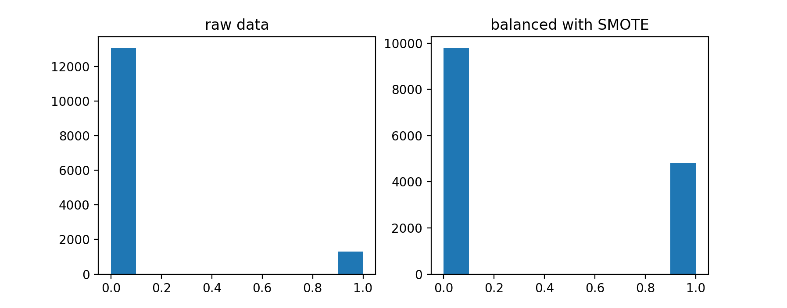

# Fraud Detection Case Study
### Drew T., Michael M., David L.
  
# Objective
## To train a fraud detection prediction model and deploy it on an application usable by fraud investigators as new cases are created.

# Step 1: Choose a Prediction Model
# EDA
## Class Imbalance

# Modeling
| Model               | Accuracy      | Recall        | Precision     | CV score      | Fit Time      |
| ------------------- | ------------- | ------------- | ------------- | ------------- | ------------- |
| Logistic Regression | 0.916         | 0.880         | 0.880         | 0.021         | 0.036 seconds |
| Random Forest       | 0.985         | 0.964         | 0.964         | 0.998         | 0.118 seconds |
| Gradient Boosting   | 0.988         | 0.975         | 0.975         | 0.981         | 3.439 seconds |
| SVM                 | 0.942         | 0.917         | 0.917         | 1.000         | 12.373 seconds|

# Step 2: Random Forest Analysis
## Feature Importance

## Ticket Prices

  
  * Median Ticket Price = $46.56
  * Max Ticket Price ~ $200,000

## Cost-Benefit Matrix
* Median cost per fraudulent case = $637.14

|       |               |Predictions    |            |
|------ |-------------- | ------------- | ---------- |
|       |               | Fraud         | Legit      |  
|Actual |     Fraud     | 0             |-46.56      |
|       |     Legit     | -637.14       | 0          | 

## Confusion Matrix

|       |               |Predictions    |            |
|------ |-------------- | ------------- | ---------- |
|       |               | Fraud         | Legit      |  
|Actual |     Fraud     | 1542          |21          |
|       |     Legit     | 55            |3249        | 

## Profit Curve

## Threshold Selection
### Our Profit curve agrees with selection of a high recall model. 
  * Investigating fraud is cheap
  * Missing fraud is expensive
### We select a threshold of 0.2, the highest probability before profit drops.

# Step 3: Deploy Application

